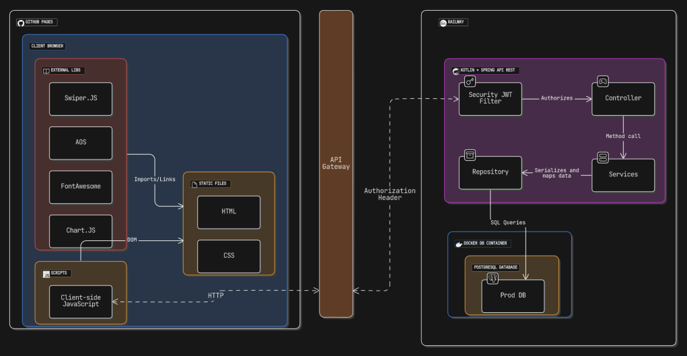

# 📘 Application Architecture Documentation

## 📌 Objective
The **engineering and architecture team** aims to study, refine, and map the composition of the application's architecture. This will ensure optimized functionality by structuring components, static assets, and necessary APIs.

This document aims to outline the architecture of the **Cashtrack** application, defining its key components, interactions, and technical choices to ensure scalability, maintainability, and efficiency.

## 🏗️ Architectural Overview

### **1. System Components**

#### 🔹 **Frontend**
- Developed using **HTML, CSS, and JavaScript**
- Designed to be **100% responsive**
- Dynamic animations and transitions
- Authentication and authorization using JWT
- Interaction with the backend via REST API

#### 🔹 **Backend**
- Built with **Kotlin + Spring Boot**
- Implements **JWT Authentication** for secure access control
- Uses **PostgreSQL** as the relational database
- Provides **RESTful APIs** for frontend interaction

#### 🔹 **Database**
- **PostgreSQL** for relational data storage
- Tables structured for **financial transactions, user management, and settings**
- Implements **indexing and query optimization** for performance

#### 🔹 **Infrastructure**
- Uses **Docker** for containerization
- **Cloud-hosted** deployment
- Secure API communication using HTTPS

## 🔗 API Structure

### **1. Authentication & Security**
| Method | Endpoint         | Description                        |
|--------|----------------|------------------------------------|
| POST   | `/api/login`    | User authentication via JWT       |
| POST   | `/api/register` | User registration                 |
| POST   | `/api/logout`   | Ends user session                 |

### **2. Financial Transactions**
| Method | Endpoint              | Description                         |
|--------|----------------------|-------------------------------------|
| GET    | `/api/transactions`  | Fetch all user transactions        |
| POST   | `/api/transactions`  | Create a new transaction           |
| PUT    | `/api/transactions/{id}` | Update a specific transaction    |
| DELETE | `/api/transactions/{id}` | Delete a specific transaction    |

### **3. User Management**
| Method | Endpoint             | Description                      |
|--------|---------------------|----------------------------------|
| GET    | `/api/user/profile` | Fetch logged-in user details    |
| PUT    | `/api/user/update`  | Update user information         |
| DELETE | `/api/user/delete`  | Delete user account             |

## 📌 Deployment Strategy

1. **Development Environment:**
   - Run locally using Docker + PostgreSQL
   - CI/CD pipelines ensure smooth deployments
2. **Staging Environment:**
   - Hosted on a separate cloud environment for testing
   - Database replication for near-production testing
3. **Production Environment:**
   - Deployed using container orchestration (Docker + Kubernetes)
   - API Gateway for load balancing and security

## 🎯 Next Steps

- Refine API versioning strategy for long-term maintainability
- Define best practices for scaling under high traffic
- Implement automated security testing

📌 **This document serves as a foundational guide for optimizing and improving the system architecture. It will be updated as the project evolves.**