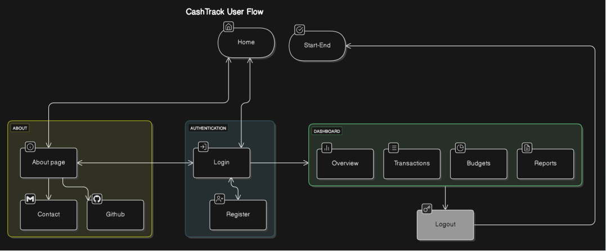
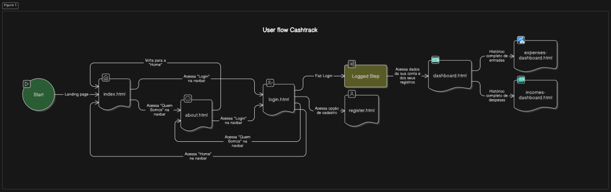

# Cashtrack - Front-End Architecture and Component Mapping

## 🎯 Objective

As a front-end developer,  
We want to map and document all components of the front-end  
So that we ensure a **modular**, **secure**, and **scalable** architecture, facilitating maintenance and integration with the back-end.

